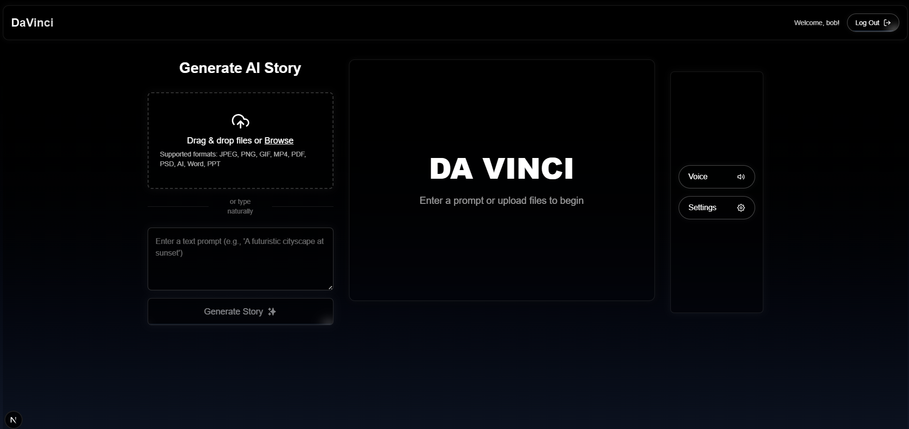

# DaVinci

## Overview

## Inspiration

Children learn in different ways, yet traditional education often fails to cater to their unique needs, interests, and cognitive abilities. Studies show that:

- 65% of people are visual learners (Social Science Research Network).
- Children remember 22 times more information when learning is tied to a narrative (Bruner, 1991).
- Over 15% of school-age children have learning disabilities, neurodivergence, or language barriers (National Center for Education Statistics).

But most educational content is rigid, offering the same material to all children, regardless of how they learn best. This creates disparities—some children thrive, while others struggle.

## What it does

DaVinci is not just an AI children's book generator—it’s an adaptive learning platform. Children can upload images, input phrases out of curiosity, and generate fully customized books with voiceovers, integrating personalized knowledge.

- ✅ Teaches knowledge based on a child’s interests & learning level
- ✅ Delivers personalized learning experiences through interactive stories
- ✅ Supports language diversity & accessibility for children with disabilities
- ✅ Encourages engagement through vivid, AI-generated illustrations

Unlike static books, DaVinci adapts to the child’s age, comprehension level, and interests, creating a learning journey that grows with them.

- 📌 Inclusivity & Accessibility: Supports neurodivergent learners, ESL students, and children with disabilities through adaptive content.
- 📌 Bridging Educational Gaps: Enables children from underserved communities to receive high-quality, engaging educational material tailored to their unique needs.
- 📌 Parental & Educator Empowerment: Allows parents and teachers to create meaningful, relevant learning materials in minutes, strengthening early childhood education.

## Screenshots

## How we built it

Next.js, Tailwind CSS, TypeScript, SQL, Gemini API, JavaScript

## Challenges we ran into

- Ensuring High-Quality AI-Generated Content: Creating educational material that is both engaging and pedagogically sound required fine-tuning AI models.
- Balancing Personalization with Accuracy: Generating stories that are highly personalized without compromising factual accuracy was a major technical challenge.
- Integration of AI APIs: Successfully integrating the Gemini API to dynamically generate age-appropriate and engaging content.

## Accomplishments that we're proud of

- Successfully built a system that adapts educational content to different learning styles.
- Seamlessly integrated AI storytelling capabilities.
- Developed an intuitive user interface that allows effortless content generation.
- Overcame technical hurdles to ensure AI-generated content remains engaging, accurate, and pedagogically valuable.

## What we learned

- How to optimize AI models for personalized educational content.
- The importance of user-friendly design in educational technology.
- Data pipelining

## What's next for DaVinci

- More Input Formats: Expanding beyond text and images to include video, PDFs, and audio input.
- Multi-Language & Accent Support: Making DaVinci accessible to children in different linguistic and cultural settings.
- Live Story Customization: Allowing users to modify details in real time for even greater personalization.
- Expanding AI Capabilities: Enhancing the storytelling engine to adapt to different educational curriculums and cultural backgrounds.

With DaVinci, we are reshaping how children learn, making education a truly personalized, engaging, and accessible experience for all!
